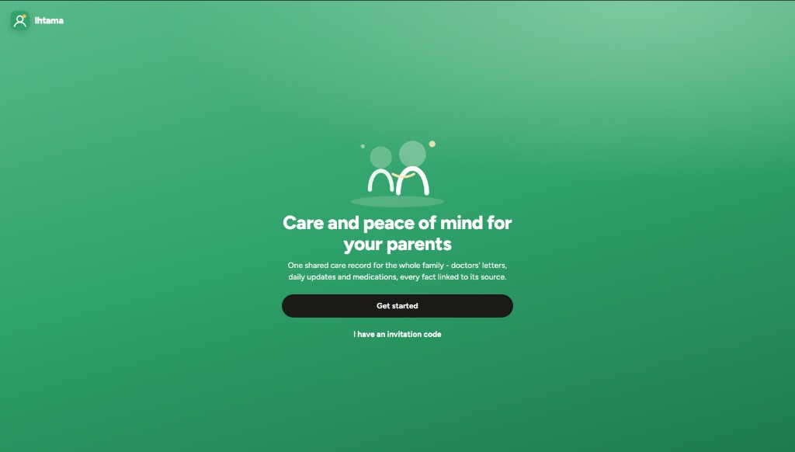
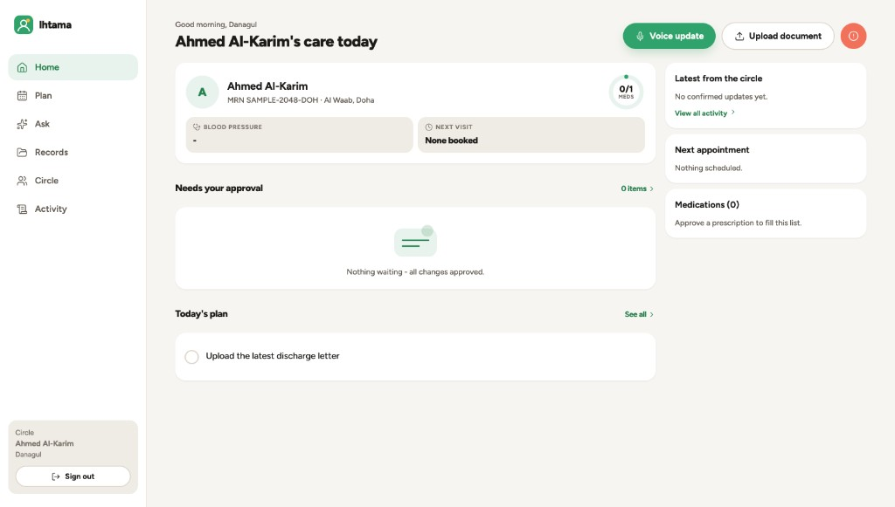
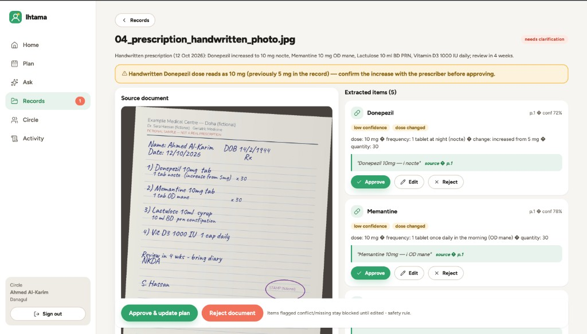
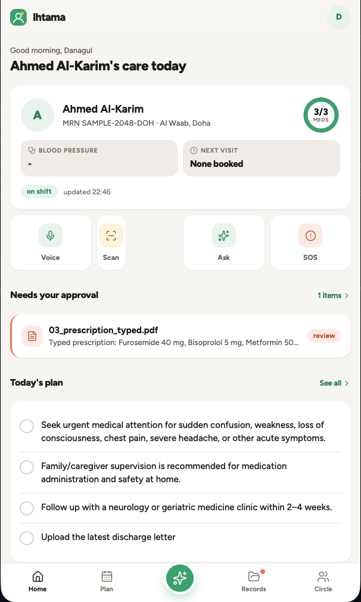

# Ihtama — AI care coordinator for families

> One parent. Many carers. One trusted care record.

Ihtama is an AI care coordinator for families looking after an elderly parent.
Care information today is scattered across WhatsApp chats, photos of prescriptions,
paper notebooks and one overloaded relative. Ihtama turns doctors' letters,
prescriptions and caregivers' voice notes into a single shared, source-linked care
record — where **nothing enters the plan without a family member's approval**, and
**every answer cites the exact page it came from**.

Built as the LLM Engineering course final project. Positioning rule: Ihtama never
diagnoses, never changes medication, never gives clinical advice — it always
redirects those questions to the doctor while showing what the record says.

## Screenshots

Responsive React PWA: sidebar from 768px up, bottom tabs on the phone. Brand:
green `#2FA36B`, coral `#F2705B`, amber `#F5B841`, ink `#15191E`.

| Onboarding | Home (desktop) |
|---|---|
|  |  |

| Review with citations | Mobile |
|---|---|
|  |  |

## Quick start

**Zero-key demo mode** (no API keys needed — deterministic fixtures simulate the
models on the 15 sample documents and 9 sample voice notes):

```bash
# backend + frontend deps
make install
# build the web app once (the API serves it)
make build
# run
make api
# open http://localhost:8000 — demo logins (password: demo1234):
#   danagul@ihtama.demo (owner) · aisha@ihtama.demo (member) · fatima@ihtama.demo (caregiver)
# invite code for new users: AHMED123
```

**Live mode**: copy `.env.example` to `.env`, set `OPENAI_API_KEY` (and LangSmith
keys for tracing) — the same flows now run GPT-4o vision extraction, Whisper
transcription and real RAG answering. `ANTHROPIC_API_KEY` enables the fallback chain.

**Docker**: `make docker` (single container: API + built web app).

**Tests / evals**:

```bash
make test        # 13 end-to-end API tests (offline)
make evals       # full 39-case golden dataset run
make evals-ab    # A/B experiment (RAG variant A vs B)
```

**MCP server** (for Claude Desktop or any MCP client):

```jsonc
// claude_desktop_config.json
{
  "mcpServers": {
    "ihtama": {
      "command": "/path/to/ihtama/.venv/bin/python",
      "args": ["/path/to/ihtama/services/mcp/server.py"],
      "env": { "IHTAMA_TOKEN": "<JWT from POST /api/auth/login>" }
    }
  }
}
```

Tools: `get_care_record`, `search_care_documents`, `propose_care_plan_change`,
`create_task`. Every call is authorised against circle Membership; proposals can only
create *pending* items that a family member must approve in the app.

## Course requirements coverage

| Requirement | Where |
|---|---|
| LangGraph multi-step workflow (branches, loops, HITL) | 3 graphs in `services/api/app/ai/graphs/` — document graph has branching (non-medical reject), a bounded edit loop, and a real `interrupt()` human-approval gate checkpointed in SQLite |
| Custom MCP server (2-3 tools) | `services/mcp/server.py` (4 tools, membership-authorised) |
| Custom Skill with SKILL.md | `skills/care-document-review/SKILL.md` — loaded into the extraction node at runtime, reusable in Claude Desktop and evals |
| RAG pipeline with reasoned choices | `services/api/app/ai/rag.py` — section-aware chunking, hybrid BM25+vector, per-circle filter, optional rerank (variant B) |
| Document processing | PDF parsing (pypdf) + GPT-4o vision for photos/screenshots |
| Multimodality | vision OCR on documents, Whisper speech-to-text for voice updates |
| LangSmith tracing | env-driven (`LANGCHAIN_TRACING_V2`), per-task tags via ModelRouter |
| Golden dataset 30+ / 2+ metrics / automated evals | `evals/` — 39 cases, F1 + branch accuracy + LLM-as-judge faithfulness + refusal correctness (safety gate = 100%) |
| A/B experiment | `python evals/run.py --ab` (RAG variant A vs B), results in `docs/EVALS.md` |
| Documented LLM/hyperparameter choice | `docs/EVALS.md` |
| Web frontend (desktop + mobile) | `apps/web` — responsive React PWA |
| Guardrails, caching, fallback, Docker, CI, auth+roles | guardrails.py, ModelRouter fallback, `infra/`, `.github/workflows/ci.yml`, JWT + owner/member/caregiver roles |

## Repository layout

```
ihtama/
  apps/web/                 # React PWA (desktop + mobile responsive)
  services/api/             # FastAPI + LangGraph graphs + RAG + guardrails
  services/mcp/             # Ihtama MCP server (stdio / streamable HTTP)
  skills/care-document-review/SKILL.md
  evals/                    # golden dataset, runner, judges, reports
  docs/                     # ARCHITECTURE.md · EVALS.md · PRESENTATION.md
  infra/                    # Dockerfile, docker-compose
  .github/workflows/ci.yml  # tests + smoke evals on every PR
```

## Privacy & safety

- Consent record per circle; per-circle isolation enforced in every query and MCP tool.
- No clinical advice, ever — classifier-routed redirect with the recorded instruction.
- Not medical software; emergencies -> local emergency number. Sample data is fictional.
